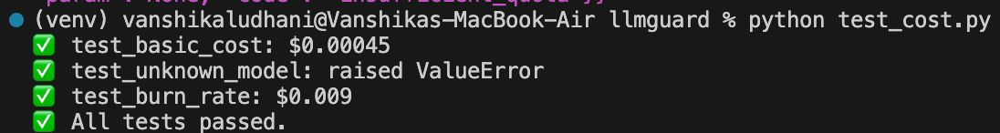
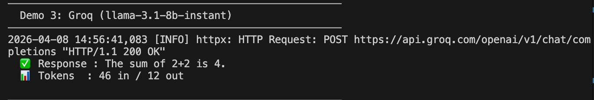
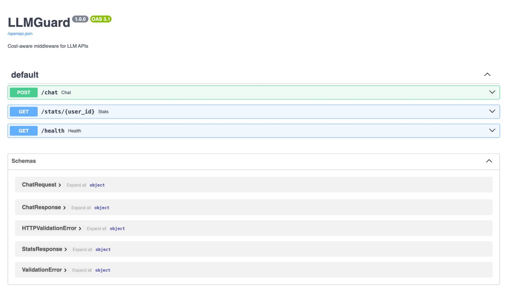

# 🛡️ LLMGuard

> Production-style cost-aware middleware for LLM APIs — OpenAI, Anthropic Claude, and Groq

LLMGuard sits between your application and any LLM provider. It transparently tracks every token spent, enforces per-user budgets, and kills runaway requests before they cost you money — across all providers through a single unified interface.

---

## 🔥 Features

- **Multi-provider** — OpenAI, Anthropic Claude, Groq — one unified interface
- **Token tracking** — every call logged with model, tokens, cost, and timestamp
- **Burn rate monitor** — sliding-window cost velocity (true $/min calculation)
- **Killswitch** — blocks requests *before* they're made if limits are exceeded
- **Daily budgets** — per-user 24-hour spending caps
- **Cross-provider fallback** — `gpt-4o` → `claude-sonnet-4-5` → `gpt-4o-mini` → `claude-haiku-4-5` → `llama3`
- **REST API** — FastAPI with `/chat`, `/stats`, and `/health` endpoints
- **Slack alerts** — webhook notifications when killswitch or daily budget triggers
- **Stress tested** — concurrent load testing with `stress_test.py`
- **Pluggable storage** — SQLite active, Redis-ready interface for production scale

---

## 📸 Screenshots

### ✅ Unit Tests Passing


### ✅ Groq Live Response


### ✅ FastAPI Swagger UI

---

## ⚙️ Setup

```bash
git clone https://github.com/VanshikaLud04/llmguard
cd llmguard
python -m venv venv
source venv/bin/activate        # Windows: venv\Scripts\activate
pip install -r requirements.txt
cp .env.example .env            # add your API keys
```

### Environment Variables

```env
OPENAI_API_KEY=sk-your-openai-key
ANTHROPIC_API_KEY=sk-ant-your-anthropic-key
GROQ_API_KEY=gsk_your-groq-key
SLACK_WEBHOOK_URL=               # optional, for alerts
```

---

## 🚀 Running

```bash
# Initialize DB and verify setup
python setup.py

# Run unit tests
python test_cost.py

# Run multi-provider demo
python demo.py

# Start API server
uvicorn main:app --reload
# → Open http://127.0.0.1:8000/docs for Swagger UI

# Stress test (requires OpenAI credits)
python stress_test.py
```

---

## 📁 Project Structure

```
llmguard/
├── llmguard/
│   ├── storage/
│   │   ├── __init__.py       # Backend switcher (SQLite ↔ Redis)
│   │   ├── base.py           # Abstract storage interface
│   │   ├── sqlite.py         # Active implementation
│   │   └── redis.py          # Roadmap — for distributed deployments
│   ├── __init__.py
│   ├── alerts.py             # Slack webhook notifications
│   ├── burn.py               # Cost velocity ($/min) calculation
│   ├── config.py             # System constants & per-user budgets
│   ├── cost.py               # Deterministic token cost calculator
│   ├── exceptions.py         # Custom exception hierarchy
│   ├── killswitch.py         # Budget enforcement logic
│   ├── pricing.py            # Provider map, pricing table & fallback chain
│   ├── providers.py          # OpenAI / Anthropic / Groq SDK routers
│   └── wrapper.py            # Core middleware (limits, retries, fallbacks)
├── .env                      # Your keys (git-ignored)
├── .env.example              # Safe template to commit
├── demo.py                   # Live multi-provider demo
├── main.py                   # FastAPI app
├── requirements.txt
├── setup.py                  # DB initializer
├── stress_test.py            # Concurrent load test (20 users)
└── test_cost.py              # Unit tests
```

---

## 🔌 API Endpoints

### `POST /chat`
Send a message through LLMGuard middleware.

```json
{
  "user_id": "user_123",
  "message": "What is 2+2?",
  "model": "gpt-4o-mini",
  "use_fallback": false
}
```

Response:
```json
{
  "user_id": "user_123",
  "model_used": "gpt-4o-mini",
  "response": "2 + 2 equals 4."
}
```

### `GET /stats/{user_id}`
Get real-time cost and usage stats for a user.

```json
{
  "user_id": "user_123",
  "requests_last_hour": 5,
  "cost_last_hour": 0.00045,
  "avg_cost_per_request": 0.00009,
  "total_cost_today": 0.00045,
  "burn_rate_per_min": 0.000075
}
```

### `GET /health`
```json
{ "status": "ok" }
```

---

## 🧠 How the Killswitch Works

Every call to `call_llm()` runs through this pipeline **before** hitting any LLM:

1. Fetch recent usage from SQLite for the user
2. Calculate burn rate (true $/min over last 60s)
3. If burn rate > `MAX_BURN_RATE_PER_MIN` → raise `BudgetExceededException` + Slack alert
4. Check total spend today vs per-user daily limit
5. If over daily limit → raise `DailyBudgetExceededException` + Slack alert
6. Only if both checks pass → route call to provider

---

## 💰 Supported Models & Pricing

| Model | Provider | Input ($/token) | Output ($/token) |
|---|---|---|---|
| gpt-4o | OpenAI | $0.000005 | $0.000015 |
| gpt-4o-mini | OpenAI | $0.00000015 | $0.00000060 |
| claude-sonnet-4-5 | Anthropic | $0.000003 | $0.000015 |
| claude-haiku-4-5 | Anthropic | $0.00000025 | $0.00000125 |
| llama-3.1-8b-instant | Groq | $0.00000005 | $0.00000008 |

---

## 🗺️ Roadmap

- [ ] Redis storage backend for distributed deployments
- [ ] Per-model budget caps (not just per-user)
- [ ] Streaming response support

---

## 🛠️ Built With

- [FastAPI](https://fastapi.tiangolo.com/) — REST API framework
- [OpenAI Python SDK](https://github.com/openai/openai-python)
- [Anthropic Python SDK](https://github.com/anthropic/anthropic-sdk-python)
- [Groq Python SDK](https://github.com/groq/groq-python)
- SQLite — lightweight persistent storage
- Python 3.13

---

## 👩‍💻 Author

**Vanshika Ludhani**  
Built as a production-style backend project demonstrating real-world LLM cost management patterns.